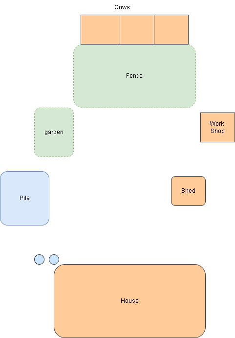

These are drawing/sketches done by Anastacio Alvarez, Jr of our homes in bufford.

## This house was the 1st house we lived in Buford, Texas.

|                                                         |
| -- |
||

## This was the 2nd house weD lived in Bufford,Texas. 

|                                                         |
| -- |
||

## This sketch shows the rooms.

|                                                         |
| -- |
||

* 1 - kitchen cabinet
* 2 - stove
* 3 - kitchen cabinet
* 4 - back door
* 5 - commode
* 6 - bath window
* 7 - kitchen table
* 8 - pantry cabinet
* 9 - pantry cabinet
* 10 - fridge
* 11 - (n/a)
* 12 - kitchen side door
* 13 - batchroom sink
* 14 - water heater
* 15 - girls closet
* 16 - boys closet
* 17 - double window,
* 18 - TV
* 19 - front ddor facing south
* 20 - Kitchen
* 21 - bathroom
* 22 - girls bedroom (Anna, Lola, and the yourger kids)
* 23 - living room
* 24 - mom, dad bedroom with crib for little ones
* 25 - Daniel, Sammy, and Jr betroom

Big window next to front door, long porch in front length of living room. 

Bath tub next to 6 north and south

## This sketch shows the layout of homestead.

|                                                         |
| -- |
|  |
